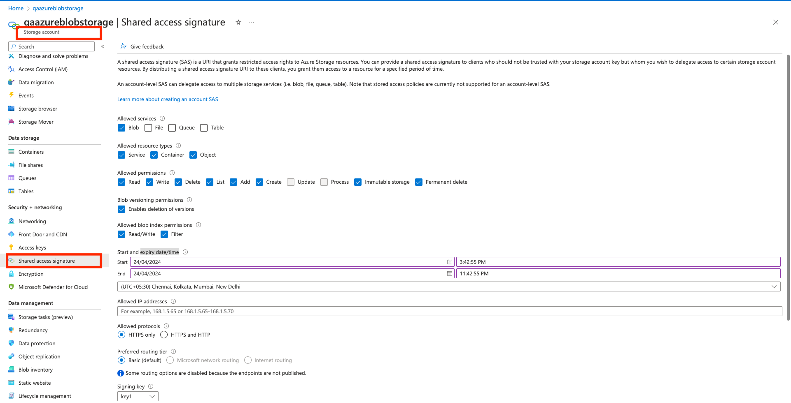
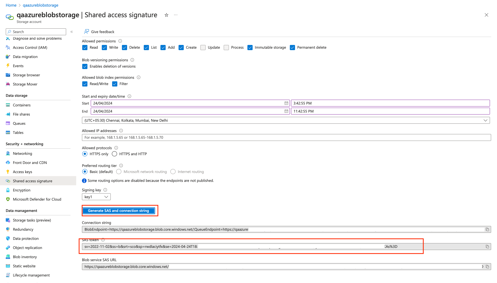

<h2>About the connector</h2>

Azure Blob Storage is Microsoft's object storage solution for the cloud. Blob Storage is optimized for storing massive amounts of unstructured data. Azure Blob Storage stores text and binary data as objects in the cloud. This connector helps you to perform REST operations for working with blobs in the Blob service.

This document provides information about the Azure Blob Storage Connector, which facilitates automated interactions, with a Azure Blob Storage server using FortiSOAR&trade; playbooks. Add the Azure Blob Storage Connector as a step in FortiSOAR&trade; playbooks and perform automated operations with Azure Blob Storage.

<h3>Version information</h3>

Connector Version: 1.1.0

FortiSOAR&trade; Version Tested on: 7.5.0-4015

Azure Blob Storage Version Tested on: Cloud instance

Authored By: Fortinet

Certified: Yes

<h2>Release Notes for version 1.1.0</h2>

Following enhancements have been made to the Azure Blob Storage Connector in version 1.1.0:

<ul>
    <li>Added the following new operations and playbooks:
        <ul>
            <li>Get Blob</li>
            <li>Copy Blob</li>
            <li>Delete Blob</li>
            <li>Abort Copy Blob</li>
            <li>Get Blob Properties</li>
            <li>Get Blob Metadata</li>
            <li>Get Blob Tags</li>
        </ul>
    </li>
    <li>Renamed the action <em>Put Blob</em> to <strong>Create Blob</strong>.</li>
</ul>

<h2>Installing the connector</h2>

Use the <strong>Content Hub</strong> to install the connector. For the detailed procedure to install a connector, click <a href="https://docs.fortinet.com/document/fortisoar/0.0.0/installing-a-connector/1/installing-a-connector" target="_top">here</a>.

You can also use the <code>yum</code> command as a root user to install the connector:

<pre>yum install cyops-connector-azure-blob-storage</pre>

<h2>Prerequisites to configuring the connector</h2>

<ul>
    <li>You must have Azure Blob Storage server credentials to which you will connect and perform automated operations.</li>
    <li>The FortiSOAR&trade; the server should have outbound connectivity to port 443 on the Azure Blob Storage server.</li>
</ul>

<h2>Minimum Permissions Required</h2>

<ul>
    <li>Not applicable</li>
</ul>

<h2>Configuring the connector</h2>

For the procedure to configure a connector, click <a href="https://docs.fortinet.com/document/fortisoar/0.0.0/configuring-a-connector/1/configuring-a-connector">here</a>

<h3>Configuration parameters</h3>

In FortiSOAR&trade;, on the Connectors page, click the <strong>Azure Blob Storage</strong> connector row (if you are in the <strong>Grid</strong> view on the Connectors page) and in the <strong>Configurations</strong> tab enter the required configuration details:

<table border=1>
    <thead>
        <tr>
            <th>Parameter</th>
            <th>Description</th>
        </tr>
    </thead>
    <tbody>
        <tr>
            <td>Storage Account Name</td>
            <td>Name of the storage account from which to perform the automated operations.</td>
        </tr>
        <tr>
            <td>Account SAS Token</td>
            <td>Account Shared Access Signature(SAS) to perform automated operations on Blob Storage Service. To generate a SAS token and assign relevant permission, refer to <a href="#generateSASToken">Generating a Shared Access Signature (SAS) Token</a>.</td>
        </tr>
        <tr>
            <td>Container Name</td>
            <td>Specify the name of the Azure container within your storage account.</td>
        </tr>
        <tr>
            <td>Verify SSL</td>
            <td>Specifies whether the SSL certificate for the server is to be verified.  By default, this option is set to <code>true</code>.</td>
        </tr>
    </tbody>
</table>

<h2>Actions supported by the connector</h2>

The following automated operations can be included in playbooks and you can also use the annotations to access operations:

<table border=1>
    <thead>
        <tr>
            <th>Function</th>
            <th>Description</th>
            <th>Annotation and Category</th>
        </tr>
    </thead>
    <tbody>
        <tr>
            <td>List Blobs</td>
            <td>Retrieves a list of blobs based on the container name you have specified.</td>
            <td>list_blob  Investigation</td>
        </tr>
        <tr>
            <td>Create Blob</td>
            <td>Creates a new blob or replaces an existing blob based on the container name, blob name, blob type and other input parameters you have specified.</td>
            <td>create_blob  Investigation</td>
        </tr>
        <tr>
            <td>Get Blob</td>
            <td>Downloads a blob from the Azure blob storage and stores it in the FortiSOAR&trade; attachment module as an attachment based on the container name and blob name you have specified.</td>
            <td>get_blob  Investigation</td>
        </tr>
        <tr>
            <td>Copy Blob</td>
            <td>Copies a blob from a source container to a destination based on the source container, destination container, and blob name you have specified</td>
            <td>copy_blob  Investigation</td>
        </tr>
        <tr>
            <td>Delete Blob</td>
            <td>Marks the specified blob or snapshot for deletion based on the container name and blob name you have specified. The blob is deleted later during the garbage collection.</td>
            <td>delete_blob  Investigation</td>
        </tr>
        <tr>
            <td>Abort Copy Blob</td>
            <td>Cancels a pending blob copy operation, and leaves a destination blob with zero length and full metadata, based on the container name and blob name you have specified.</td>
            <td>abort_copy_blob  Investigation</td>
        </tr>
        <tr>
            <td>Get Blob Properties</td>
            <td>Retrieves all user-defined metadata, standard HTTP properties, and system properties for the blob based on the container name and blob name you have specified. It doesn't return the contents of the blob.</td>
            <td>get_blob_properties  Investigation</td>
        </tr>
        <tr>
            <td>Get Blob Metadata</td>
            <td>Retrieves all user-defined metadata for the specified blob or snapshot based on the container name and blob name you have specified.</td>
            <td>get_blob_metadata  Investigation</td>
        </tr>
        <tr>
            <td>Get Blob Tags</td>
            <td>Retrieves all user-defined tags for the specified blob, version, or snapshot based on the container name and blob name you have specified.</td>
            <td>get_blob_tags  Investigation</td>
        </tr>
    </tbody>
</table>

<h3>operation: List Blobs</h3>

<h4>Input parameters</h4>

<table border=1>
    <thead>
        <tr>
            <th>Parameter</th>
            <th>Description</th>
        </tr>
    </thead>
    <tbody>
        <tr>
            <td>Container Name</td>
            <td>(Optional) Specify the name of the container from which to retrieve the list of blobs. If this value is not specified, then the default container name value is used from the configuration.</td>
        </tr>
    </tbody>
</table>

<h4>Output</h4>

The output contains the following populated JSON schema:

<pre>{
    "EnumerationResults": {
        "@ServiceEndpoint": "",
        "@ContainerName": "",
        "Blobs": {
            "Blob": [
                {
                    "Name": "",
                    "Properties": {
                        "Creation-Time": "",
                        "Last-Modified": "",
                        "Etag": "",
                        "Content-Length": "",
                        "Content-Type": "",
                        "Content-Encoding": "",
                        "Content-Language": "",
                        "Content-CRC64": "",
                        "Content-MD5": "",
                        "Cache-Control": "",
                        "Content-Disposition": "",
                        "BlobType": "",
                        "AccessTier": "",
                        "AccessTierInferred": "",
                        "LeaseStatus": "",
                        "LeaseState": "",
                        "ServerEncrypted": ""
                    },
                    "OrMetadata": ""
                }
            ]
        },
        "NextMarker": ""
    }
}</pre>

<h3>operation: Create Blob</h3>

<h4>Input parameters</h4>

<table border=1>
    <thead>
        <tr>
            <th>Parameter</th>
            <th>Description</th>
        </tr>
    </thead>
    <tbody>
        <tr>
            <td>Container Name</td>
            <td>(Optional) Specify the name of the container in which to create a blob. If this value is not specified, then the default container name value is used from the configuration.</td>
        </tr>
        <tr>
            <td>Blob Name</td>
            <td>Specify the name of the blob to create or replace.</td>
        </tr>
        <tr>
            <td>Type</td>
            <td>Select the type of the blob based on whether users can upload a file to Azure Blob storage. You can choose from following options:
                <ul>
                    <li><strong>Attachment ID</strong>: Specify the attachment ID, to access the attachment metadata from the FortiSOAR&trade; <em>Attachments</em> module, in the <strong>Attachment ID</strong> field.</li>
                    <li><strong>File IRI</strong>: Specify the file IRI, to access the attachment metadata from the FortiSOAR&trade; <em>Attachments</em> module, in the <strong>File IRI</strong> field.</li>
                </ul>
            </td>
        </tr>
        <tr>
            <td>Timeout</td>
            <td>(Optional) Specify the time for the server to wait before the service has finished processing the request. The default and maximum value is <code>30</code> seconds.</td>
        </tr>
    </tbody>
</table>

<h4>Output</h4>

The output contains the following populated JSON schema:

<pre>{
    "Date": "",
    "ETag": "",
    "Server": "",
    "result": "",
    "status": "",
    "Content-MD5": "",
    "x-ms-version": "",
    "Last-Modified": "",
    "Content-Length": "",
    "x-ms-request-id": "",
    "x-ms-content-crc64": "",
    "x-ms-request-server-encrypted": ""
}</pre>

<h3>operation: Get Blob</h3>

<h4>Input parameters</h4>

<table border=1>
    <thead>
        <tr>
            <th>Parameter</th>
            <th>Description</th>
        </tr>
    </thead>
    <tbody>
        <tr>
            <td>Container Name</td>
            <td>(Optional) Specify the name of the container from which to retrieve the specified blob. If this value is not specified, then the default container name value is used from the configuration.</td>
        </tr>
        <tr>
            <td>Blob Name</td>
            <td>Specify the name of the blob for which to retrieve specific blob details.</td>
        </tr>
    </tbody>
</table>

<h4>Output</h4>

The output contains the following populated JSON schema:

<pre>{
    "id": "",
    "@id": "",
    "cVEs": [],
    "file": {
        "id": "",
        "@id": "",
        "size": "",
        "uuid": "",
        "@type": "",
        "assignee": "",
        "filename": "",
        "metadata": [],
        "mimeType": "",
        "thumbnail": "",
        "uploadDate": ""
    },
    "name": "",
    "type": "",
    "uuid": "",
    "@type": "",
    "tasks": [],
    "alerts": [],
    "assets": [],
    "owners": [],
    "people": [],
    "@context": "",
    "assignee": "",
    "comments": [],
    "warrooms": [],
    "incidents": [],
    "createDate": "",
    "createUser": {
        "id": "",
        "@id": "",
        "name": "",
        "uuid": "",
        "@type": "",
        "avatar": "",
        "userId": "",
        "userType": "",
        "createDate": "",
        "createUser": "",
        "modifyDate": "",
        "modifyUser": ""
    },
    "indicators": [],
    "modifyDate": "",
    "modifyUser": {
        "id": "",
        "@id": "",
        "name": "",
        "uuid": "",
        "@type": "",
        "avatar": "",
        "userId": "",
        "userType": "",
        "createDate": "",
        "createUser": "",
        "modifyDate": "",
        "modifyUser": ""
    },
    "recordTags": [],
    "userOwners": [],
    "workspaces": [],
    "description": "",
    "vulnerabilities": []
}</pre>

<h3>operation: Copy Blob</h3>

<h4>Input parameters</h4>

<table border=1>
    <thead>
        <tr>
            <th>Parameter</th>
            <th>Description</th>
        </tr>
    </thead>
    <tbody>
        <tr>
            <td>Source Container Name</td>
            <td>Specify the name of the container from which to copy the blob.</td>
        </tr>
        <tr>
            <td>Blob Name</td>
            <td>Specify a new name for the blob after it's copied to the destination container.</td>
        </tr>
        <tr>
            <td>Destination Container Name</td>
            <td>Specify the name of the destination container to which to copy the blob.</td>
        </tr>
    </tbody>
</table>

<h4>Output</h4>

The output contains the following populated JSON schema:

<pre>{
    "Date": "",
    "ETag": "",
    "Server": "",
    "x-ms-copy-id": "",
    "x-ms-version": "",
    "Last-Modified": "",
    "Content-Length": "",
    "x-ms-request-id": "",
    "x-ms-copy-status": ""
}</pre>

<h3>operation: Delete Blob</h3>

<h4>Input parameters</h4>

<table border=1>
    <thead>
        <tr>
            <th>Parameter</th>
            <th>Description</th>
        </tr>
    </thead>
    <tbody>
        <tr>
            <td>Container Name</td>
            <td>(Optional) Specify the name of the container in which to delete the blob. If this value is not specified, then the default container name value from the configuration is used.</td>
        </tr>
        <tr>
            <td>Blob Name</td>
            <td>Specify the name of the blob to delete.</td>
        </tr>
    </tbody>
</table>

<h4>Output</h4>

The output contains the following populated JSON schema:

<pre>{
    "Date": "",
    "Server": "",
    "x-ms-version": "",
    "Content-Length": "",
    "x-ms-request-id": "",
    "x-ms-delete-type-permanent": ""
}</pre>

<h3>operation: Abort Copy Blob</h3>

<h4>Input parameters</h4>

<table border=1>
    <thead>
        <tr>
            <th>Parameter</th>
            <th>Description</th>
        </tr>
    </thead>
    <tbody>
        <tr>
            <td>Container Name</td>
            <td>(Optional) Specify the name of the container from which to abort the copy blob. If this value is not specified, then the default container name value is used from the configuration.</td>
        </tr>
        <tr>
            <td>Blob Name</td>
            <td>Specify the name of your destination blob.</td>
        </tr>
        <tr>
            <td>Copy Blob ID</td>
            <td>Specify the copy identifier provided in the x-ms-copy-id header of the original Copy Blob action.</td>
        </tr>
    </tbody>
</table>

<h4>Output</h4>

The output contains a non-dictionary value.

<h3>operation: Get Blob Properties</h3>

<h4>Input parameters</h4>

<table border=1>
    <thead>
        <tr>
            <th>Parameter</th>
            <th>Description</th>
        </tr>
    </thead>
    <tbody>
        <tr>
            <td>Container Name</td>
            <td>(Optional) Specify the name of the container to retrieve the specified blob Properties from. If this value is not specified, then the default container name value is used from the configuration.</td>
        </tr>
        <tr>
            <td>Blob Name</td>
            <td>Specify the name of the blob for which to retrieve the properties.</td>
        </tr>
    </tbody>
</table>

<h4>Output</h4>

The output contains the following populated JSON schema:

<pre>{
    "Date": "",
    "ETag": "",
    "Server": "",
    "Content-MD5": "",
    "x-ms-meta-k": "",
    "Content-Type": "",
    "x-ms-meta-k2": "",
    "x-ms-meta-k3": "",
    "x-ms-version": "",
    "Accept-Ranges": "",
    "Last-Modified": "",
    "Content-Length": "",
    "x-ms-blob-type": "",
    "x-ms-tag-count": "",
    "x-ms-request-id": "",
    "x-ms-access-tier": "",
    "x-ms-lease-state": "",
    "x-ms-lease-status": "",
    "x-ms-creation-time": "",
    "x-ms-server-encrypted": "",
    "x-ms-access-tier-inferred": ""
}</pre>

<h3>operation: Get Blob Metadata</h3>

<h4>Input parameters</h4>

<table border=1>
    <thead>
        <tr>
            <th>Parameter</th>
            <th>Description</th>
        </tr>
    </thead>
    <tbody>
        <tr>
            <td>Container Name</td>
            <td>(Optional) Specify the name of the container to retrieve all user-defined metadata for the specified blob or snapshot. If this value is not specified, then the default container name value is used from the configuration.</td>
        </tr>
        <tr>
            <td>Blob Name</td>
            <td>Specify the name of the blob for which to retrieve all user-defined metadata for the specified blob or snapshot.</td>
        </tr>
    </tbody>
</table>

<h4>Output</h4>

The output contains the following populated JSON schema:

<pre>{
    "Date": "",
    "ETag": "",
    "Server": "",
    "x-ms-meta-k": "",
    "x-ms-meta-k2": "",
    "x-ms-meta-k3": "",
    "x-ms-version": "",
    "Last-Modified": "",
    "Content-Length": "",
    "x-ms-request-id": ""
}</pre>

<h3>operation: Get Blob Tags</h3>

<h4>Input parameters</h4>

<table border=1>
    <thead>
        <tr>
            <th>Parameter</th>
            <th>Description</th>
        </tr>
    </thead>
    <tbody>
        <tr>
            <td>Container Name</td>
            <td>(Optional) Specify the name of the container to retrieve all user-defined tags for the specified blob or snapshot. If this value is not specified, then the default container name value is used from the configuration.</td>
        </tr>
        <tr>
            <td>Blob Name</td>
            <td>Specify the name of the blob for which to retrieve all user-defined tags for the specified blob or snapshot.</td>
        </tr>
    </tbody>
</table>

<h4>Output</h4>

The output contains the following populated JSON schema:

<pre>{
    "Tags": {
        "TagSet": {
            "Tag": [
                {
                    "Key": "",
                    "Value": ""
                }
            ]
        }
    }
}</pre>

<h2>Included playbooks</h2>

The <code>Sample - Azure Blob Storage - 1.1.0</code> playbook collection comes bundled with the Azure Blob Storage connector. These playbooks contain steps using which you can perform all supported actions. You can see bundled playbooks in the <strong>Automation</strong> &gt; <strong>Playbooks</strong> section in FortiSOAR&trade; after importing the Azure Blob Storage connector.

<ul>
    <li>Abort Copy Blob</li>
    <li>Copy Blob</li>
    <li>Create Blob</li>
    <li>Delete Blob</li>
    <li>Get Blob</li>
    <li>Get Blob Metadata</li>
    <li>Get Blob Properties</li>
    <li>Get Blob Tags</li>
    <li>List Blobs</li>
</ul>

<strong>Note</strong>: If you are planning to use any of the sample playbooks in your environment, ensure that you clone those playbooks and move them to a different collection since the sample playbook collection gets deleted during connector upgrade and delete.

<h2>Generating a Shared Access Signature (SAS) Token</h2>

This section helps create and set up a SAS token with recommended permissions.

<ol>
    <li>Sign in to the Azure Portal (<a href="https://portal.azure.com/">https://portal.azure.com/</a>).</li>
    <li>Open the Azure Storage Service.</li>
    <li>Select the <strong>Shared Access Signature</strong> option from the left-hand navigation menu in Azure Storage Service.</li>
    <li>Select the minimum permissions.
        <ul>
            <li><strong>Allowed services:</strong>
                <ul>
                    <li>Blob</li>
                </ul>
            </li>
            <li><strong>Allowed resource type</strong>:
                <ul>
                    <li>Service</li>
                    <li>Container</li>
                    <li>Object</li>
                </ul>
            </li>
            <li><strong>Allowed permissions</strong>:
                <ul>
                    <li>Read</li>
                    <li>Write</li>
                    <li>Delete</li>
                    <li>list</li>
                    <li>Add</li>
                    <li>Create</li>
                    <li>Immutable Storage</li>
                    <li>Permanent Delete</li>
                </ul>
            </li>
            <li><strong>Blob versioning permissions</strong>:
                <ul>
                    <li>Enables deletion of versions</li>
                </ul>
            </li>
            <li><strong>Allowed blob index permissions</strong>:
                <ul>
                    <li>Read/Write</li>
                    <li>Filter</li>
                </ul>
            </li>
        </ul>
        
Following screenshot shows the minimum required permissions:

        

    </li>
    <li>Select the date and time of SAS token's expiry.</li>
    <li>Click the <strong>Generate SAS and connection string</strong> button to generate the token.</li>
    

</ol>